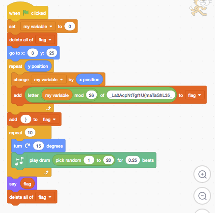

I noticed that scratch projects are downloadable as a `.sb3`, which is actually just a `.zip`. I zipped the following program (which just takes every third character of a string, but should be fairly difficult to reverse without doing the scratch part). We could either give them just the `project.json` and have them zip it with the default files (since the hashed names are the same every time), or we could give them all of the files including sounds, etc.

